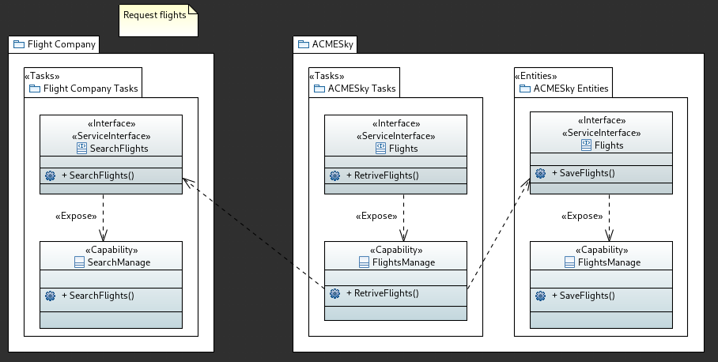
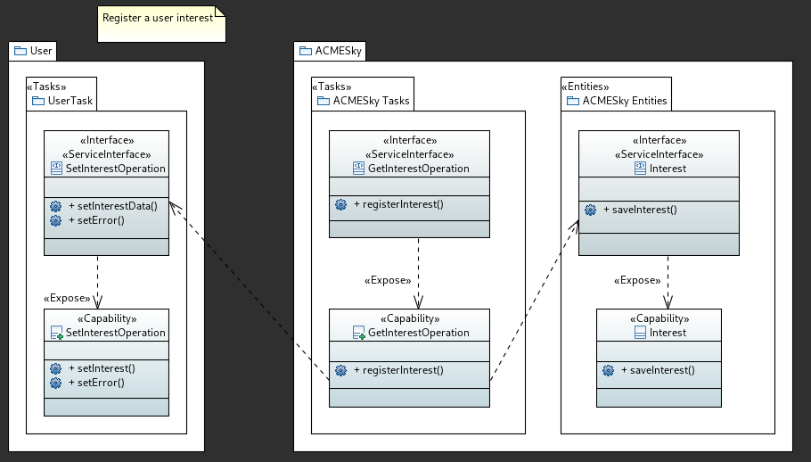
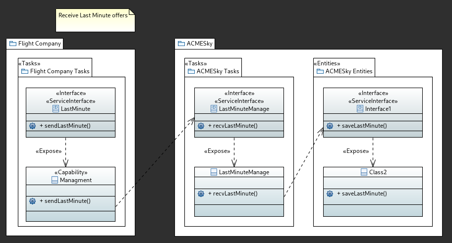
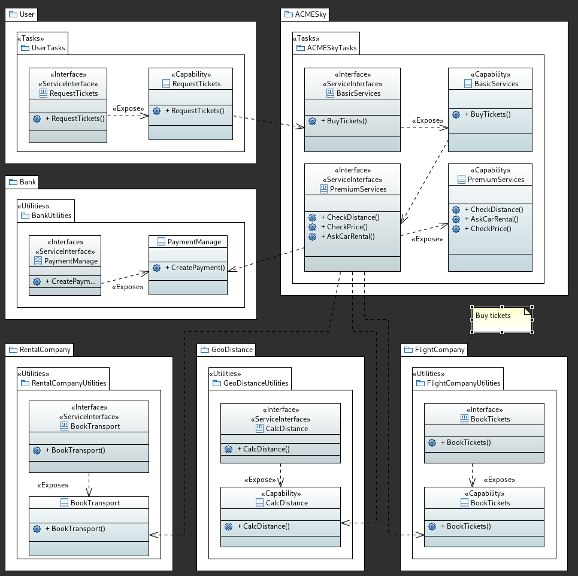

# UML

> TODO: controlla e modifica

In this section, the SOA modeling for the ACMESky organization is presented using UML diagrams with the TinySOA profile. These diagrams aim to highlight the capabilities accessible through the system and the interfaces that expose them, both externally and internally, for each service within the SOA. Specifically, there are three types of services:

- **Task (or Process)**: Exposes capabilities achieved through internal processes, potentially involving human participation. These are closely related to the domain problem.
- **Entity**: Represents a single activity, usually automated (e.g., saving a record in a database).
- **Utility**: Similar to Tasks but not directly tied to the domain problem.

## Requesting flights

> TODO: description

## Registering a user's interest

For ACMESky, the identified capabilities are `Interest` and `GetInterestOperation`. Both capabilities are exposed through two interfaces. These capabilities enable the system to capture a user's interest in a trip and save it for future reference.

Additionally, another capability, `SetInterestOperation`, was identified for the user from the BPsMN diagram. This capability allows the user to receive feedback on the success or failure of their interest registration.

## Receiving and notify last-minute offers

> TODO: description

## Buying a ticket

> TODO: description
