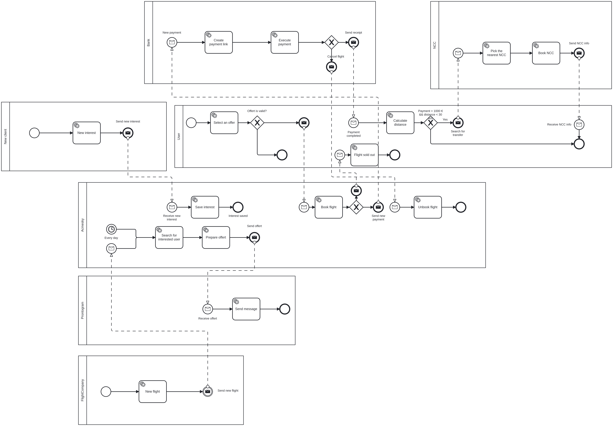

# BPMN

This documentation provides a simple overview of the BPMN (Business Process Model and Notation) diagram developed using Camunda Modeler. The BPMN diagram is an essential tool for modeling, visualizing, and optimizing complex business processes, ensuring that all stages of the process are clearly outlined and understandable.

The BPMN diagram includes many participants representing the main actors and components of the system. Below is a description of the participants' configuration and their interactions within the others.

## Participants

### New client

The _New client_ participant represents a new customer in the system. The client submits an interest on the platform through the ACMESky webpage, which initiates the process.

### User

The _User_ participant represents the system's end-user, playing a central role in interacting with the platform. The user can initiate the purchase process submiting a code previously received. This action sets off a series of automated steps within the system, such as confirming flight availability, generating a token for the booking, and processing payment details. The user's interactions are key to triggering and advancing various business processes within the ACMESky system.

### ACMESky

The _ACMESky_ participant serves as both the service provider and the process coordinator. It is responsible for monitoring user interests on the platform, checking for any expressed interest, and coordinating the necessary actions. Once an interest is identified, ACMESky triggers a notification to the user via the external messaging service, Prontogram, ensuring timely updates about relevant offers or flight details. Additionally, ACMESky manages other key system functions, such as user profile operations and flight availability, ensuring smooth interaction between the user and the platform.

### Prontogram

The _Prontogram_ participant represents the ACMESky's messaging microservice. It waits for notifications from ACMESky and then proceeds to interact with the user, delivering updates based on the user's interests.

### Flight Company

The _Flight Company_ participant represents an individual airline company within the system. It has the capability to add new flights and ticket information to the system.

### NCC

The _NCC_ participant functions as a service provider that waits for messages from ACMESky to book the nearest available NCC. Upon receiving a request, it processes the booking by identifying and reserving the closest available vehicle.

### Bank

The _Bank_ participant handles payment processing within the system. Upon receiving a request from ACMESky, it generates a new payment link for the transaction. The participant then waits for confirmation that the payment has been successfully completed. In addition to processing payments, the _Bank_ participant also has the capability to handle payment cancellations if required.
