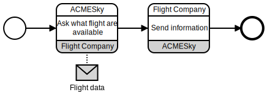
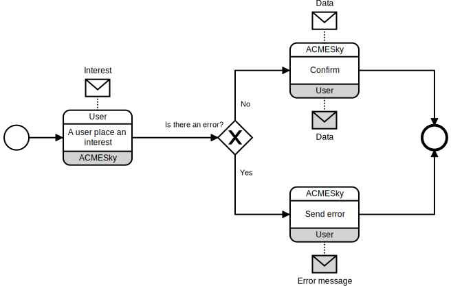
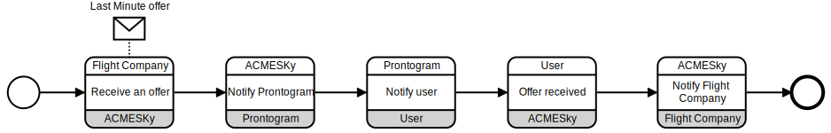
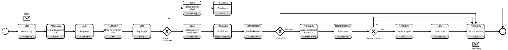

# BPMN Choreographies

The choreographies in bpmn format are inserted below. They follow the formal choreographies in an identical way.

## Requesting flight's information

{ width=100% }

## Registering a user's interest

{ width=100% }

## Last-minute offers

{ width=100% }

## Buying a ticket

{ width=100% }
