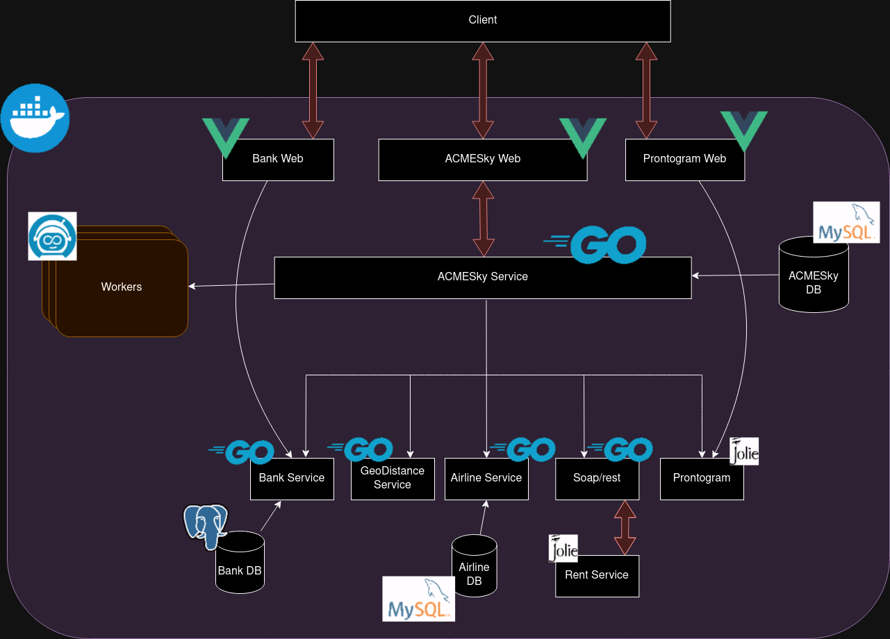

# SOA Schema

Here is the interal schema of the services:

## Port assigned to each service

| Service              | Port                          |
| -------------------- | ----------------------------- |
| ACMESkyWeb           | (8078)[http://localhost:8078] |
| ACMESkyService       | (8090)[http://localhost:8090] |
| ACMESkyDB            | (3306)[http://localhost:3306] |
| ACMESkyNCC           | (8089)[http://localhost:8089] |
| BankWeb              | (8083)[http://localhost:8083] |
| BankSerivice         | (8094)[http://localhost:8094] |
| BankDb               | (3308)[http://localhost:3308] |
| FlightCompanyService | (8091)[http://localhost:8091] |
| FlightCompanyDB      | (3307)[http://localhost:3307] |
| GeoDistance          | (8093)[http://localhost:8093] |
| ProntogramWeb        | (8079)[http://localhost:8079] |
| ProntogramService    | (8092)[http://localhost:8092] |
| Operate              | (8092)[http://localhost:8092] |
| Tasklist             | (8082)[http://localhost:8082] |
| Workers              | (8080)[http://localhost:8080] |
